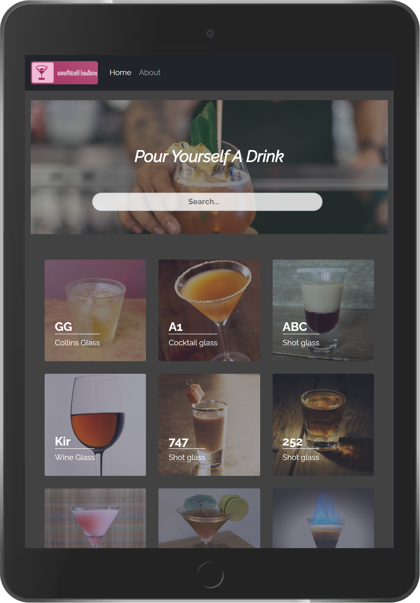

<h1 align="center"> Cocktail Index   (React, Bootstrap 5) </h1>

<i>A React and Bootstrap 5 based cocktail index SPA(Single Page Application), with search feature.</i>

## Table of Contents

- [Live Demo](#live-demo)
- [Description](#description)
- [Tech Stack](#tech-stack)
- [Key Features](#key-features)
- [Project Setup](#project-setup)
- [Future Scope](#future-scope)

## Live Demo

<h2 align="center"><a  href="https://ll-react-cocktail-index.netlify.app/">Live Demo Link</a></h2>

|                                                Mobile View                                                 |                                          Tablet View                                          |
| :--------------------------------------------------------------------------------------------------------: | :-------------------------------------------------------------------------------------------: |
|  |  |

## Description

A React and Bootstrap 5 based cocktail index SPA(Single Page Application), with search feature.
This app powered by [TheCocktailDB API](https://www.thecocktaildb.com/), deployed on Netlify.

<!-- =============================================== -->

## Tech Stack

#### Frontend:

- React.js,
- React Router
- React useContext API
- Bootstrap 5
- Font Awesome

#### Development:

- GIT - for version control
- Bash - for CLI
- NPM - for package managing
<!-- =============================================== -->

## Key Features

- Fetch data from REST API
- Search item based on name
- Unique URL path to show item details
- Responsive design with Bootstrap 5

## Project Setup

1. In root directory, run "npm install".
2. Then run "npm start".

## Future Scope

- Add pagination feature
